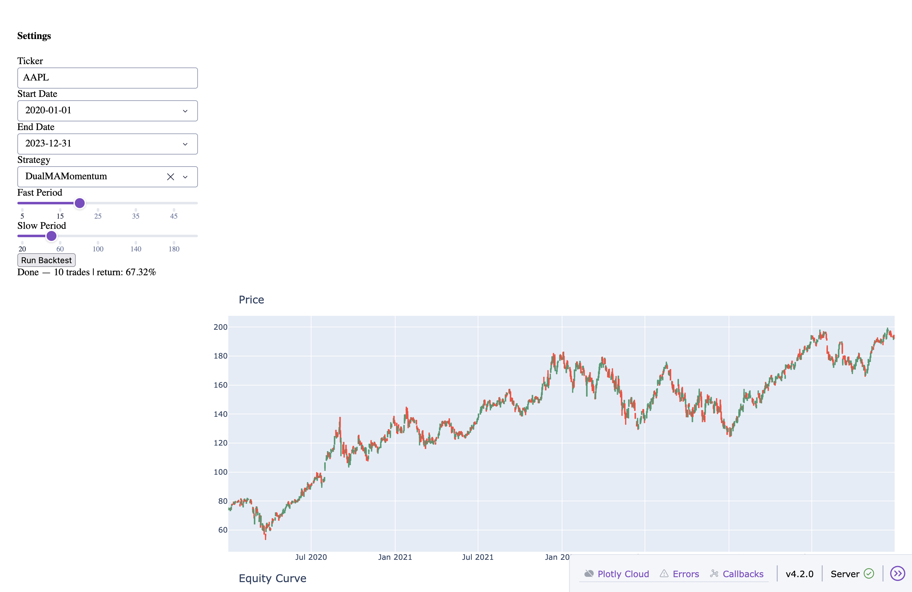

# Quantitative Trading Framework

> A production-grade algorithmic trading research platform — data pipeline, strategy engine, backtester, performance analytics, and interactive dashboard, all in pure Python.


---

## What is this?

This framework lets you go from raw market data to a fully evaluated trading strategy in minutes. It handles everything: fetching and caching price data, running momentum and mean-reversion strategies, simulating realistic trade costs, computing institutional-grade performance metrics, and visualising results in a live interactive dashboard.

It was built to be read, extended, and learned from — every module is independently testable, every abstraction has a clear boundary, and the data flows in one direction from fetch → strategy → backtest → analytics → dashboard.

---

## Features

| Layer | What it does |
|-------|-------------|
| **Data** | Fetches OHLCV from Yahoo Finance with Alpha Vantage fallback. Caches everything in SQLite with TTL expiry and zlib compression. |
| **Strategies** | Dual Moving Average crossover and Bollinger Band mean-reversion, built on Backtrader with configurable parameters. |
| **Backtesting** | Realistic simulation with per-trade commission, percentage slippage, and a walk-forward train/test splitter to prevent overfitting. |
| **Optimisation** | Grid search over parameter combinations on the training window; best params are evaluated on the held-out test window. |
| **Analytics** | Sharpe ratio, Sortino ratio, annualised return, max drawdown, win rate, profit factor — all computed from the equity curve. QuantStats tearsheet export. |
| **Dashboard** | Plotly Dash UI — interactive candlestick chart, equity curve, metrics table. Change ticker, dates, strategy and parameters live. |

---

## Screenshots



*AAPL 2020–2023, DualMAMomentum (fast=20, slow=60) — 10 trades, +67.32% return*

---

## Architecture

```
┌─────────────────────────────────────────────────────────┐
│                    Dash Dashboard                        │
│          (layout.py · callbacks.py · app.py)            │
└───────────────────────┬─────────────────────────────────┘
                        │
┌───────────────────────▼─────────────────────────────────┐
│                  Analytics Layer                         │
│        metrics.py · equity.py · tearsheet.py            │
└───────────────────────┬─────────────────────────────────┘
                        │
┌───────────────────────▼─────────────────────────────────┐
│                  Backtest Engine                         │
│       runner.py · optimizer.py · splitter.py            │
└──────────┬────────────────────────┬─────────────────────┘
           │                        │
┌──────────▼──────────┐  ┌──────────▼──────────────────┐
│     Strategies       │  │        Data Layer            │
│  momentum.py         │  │  fetcher.py  (yfinance/AV)  │
│  mean_reversion.py   │  │  cache.py    (SQLite+zlib)  │
│  signals.py          │  │  models.py   (Pydantic)     │
└──────────────────────┘  └─────────────────────────────┘
```

---

## Quick Start

### 1. Clone and set up environment

```bash
git clone https://github.com/faizanakhan2003/quantitative-finance.git
cd quantitative-finance

# requires Python 3.11+
python -m venv .venv
source .venv/bin/activate          # Windows: .venv\Scripts\activate
pip install -r requirements.txt
```

### 2. Configure (optional)

```bash
cp .env.example .env
# edit .env to add your Alpha Vantage API key (optional — yfinance works without one)
```

### 3. Launch the dashboard

```bash
python -m quant_trading.dashboard
```

Open [http://localhost:8050](http://localhost:8050) in your browser.

### 4. Run the test suite

```bash
python -m pytest tests/ -v
# 53 tests, ~2 seconds
```

---

## Project Structure

```
quantitative-finance/
│
├── quant_trading/
│   ├── data/
│   │   ├── fetcher.py          # DataFetcher — yfinance + Alpha Vantage
│   │   ├── cache.py            # PriceCache — SQLite with TTL + compression
│   │   └── models.py           # OHLCVBar, PriceHistory (Pydantic)
│   │
│   ├── strategies/
│   │   ├── base.py             # BaseStrategy — sizing, order logging
│   │   ├── momentum.py         # DualMAMomentum — MA crossover
│   │   ├── mean_reversion.py   # BollingerMeanReversion — Z-score
│   │   └── signals.py          # Pure pandas signal functions
│   │
│   ├── backtest/
│   │   ├── runner.py           # BacktestRunner — cerebro wrapper
│   │   ├── splitter.py         # walk_forward_splits
│   │   ├── optimizer.py        # grid_search, walk_forward_optimize
│   │   └── results.py          # BacktestResult dataclass
│   │
│   ├── analytics/
│   │   ├── metrics.py          # Sharpe, Sortino, drawdown, win rate
│   │   ├── equity.py           # extract_equity_curve
│   │   └── tearsheet.py        # QuantStats HTML report
│   │
│   └── dashboard/
│       ├── app.py              # Dash app instance
│       ├── layout.py           # UI components
│       ├── callbacks.py        # Interactivity — inputs → outputs
│       └── __main__.py         # Entry point
│
├── tests/
│   ├── test_data.py            # 19 tests — fetcher, cache, models
│   ├── test_strategies.py      # 6 tests  — signals, strategy smoke tests
│   ├── test_backtest.py        # 7 tests  — runner, splitter, optimizer
│   ├── test_analysis.py        # 6 tests  — metrics, equity curve
│   └── test_dashboard.py       # 8 tests  — chart builders, param mapping
│
├── config/
│   └── settings.py             # Pydantic-settings config
│
├── docs/                       # Extended documentation
├── .env.example                # Environment variable template
├── requirements.txt            # All dependencies
└── LICENSE                     # MIT
```

---

## Usage Examples

### Fetch data programmatically

```python
from quant_trading.data import DataFetcher

fetcher = DataFetcher()
history = fetcher.fetch("TSLA", start="2022-01-01", end="2023-12-31")
df = history.to_dataframe()
print(df.tail())
```

### Run a backtest

```python
from quant_trading.backtest import BacktestRunner
from quant_trading.strategies import DualMAMomentum
from quant_trading.data import DataFetcher

fetcher = DataFetcher()
history = fetcher.fetch("MSFT", "2021-01-01", "2023-12-31")
df = history.to_dataframe()

runner = BacktestRunner(commission=0.001, slippage=0.0005, initial_cash=100_000)
result = runner.run(DualMAMomentum, df, params={"fast_period": 20, "slow_period": 50})

print(f"Return:     {result.total_return_pct:.2f}%")
print(f"Trades:     {result.num_trades}")
print(f"Metrics:    {result.compute_metrics()}")
```

### Walk-forward optimisation

```python
from quant_trading.backtest import BacktestRunner, walk_forward_optimize
from quant_trading.strategies import DualMAMomentum

param_grid = {
    "fast_period": [10, 20, 30],
    "slow_period": [40, 60, 80],
}

folds = walk_forward_optimize(
    DualMAMomentum,
    df,
    param_grid=param_grid,
    train_bars=750,
    test_bars=250,
    runner=BacktestRunner(),
)

for fold in folds:
    print(f"Fold {fold['fold']} — best params: {fold['best_params']}")
    print(f"  Train return: {fold['train_result'].total_return_pct:.2f}%")
    print(f"  Test  return: {fold['test_result'].total_return_pct:.2f}%")
```

### Generate a QuantStats tearsheet

```python
from quant_trading.analytics import generate_tearsheet

result = runner.run(DualMAMomentum, df)
returns = result.equity_curve["returns"].dropna()
generate_tearsheet(returns, output_path="report.html", title="AAPL Momentum")
```

---

## Configuration

All settings are read from a `.env` file or environment variables.

| Variable | Default | Description |
|----------|---------|-------------|
| `ALPHA_VANTAGE_API_KEY` | `""` | Optional. Used as fallback when yfinance fails. |
| `CACHE_DB_PATH` | `data/cache.db` | Path to the SQLite cache database. |
| `CACHE_TTL_HOURS` | `24` | How long cached data is considered fresh. |
| `LOG_LEVEL` | `INFO` | Python logging level (`DEBUG`, `INFO`, `WARNING`). |

See [docs/configuration.md](docs/configuration.md) for full details.

---

## Documentation

| Document | Description |
|----------|-------------|
| [Architecture](docs/architecture.md) | System design, data flow, module boundaries |
| [Data Layer](docs/data_layer.md) | Fetching, caching, and validating price data |
| [Strategies](docs/strategies.md) | How the trading strategies work |
| [Backtesting](docs/backtesting.md) | Backtest engine, costs, walk-forward splitting |
| [Analytics](docs/analytics.md) | Performance metrics explained |
| [Dashboard](docs/dashboard.md) | Running and using the Dash UI |
| [Configuration](docs/configuration.md) | All environment variables and settings |
| [Contributing](docs/contributing.md) | How to add a new strategy or extend the framework |
| [API Reference](docs/api_reference.md) | Complete signature reference for every public class and function |

---

## Dependencies

| Package | Purpose |
|---------|---------|
| `yfinance` | Primary market data source |
| `alpha-vantage` | Fallback market data source |
| `backtrader` | Strategy execution and simulation engine |
| `pandas` / `numpy` | Data manipulation and numerical computing |
| `pydantic` / `pydantic-settings` | Data validation and config management |
| `quantstats` | Portfolio analytics and tearsheet generation |
| `plotly` / `dash` | Interactive charting and dashboard |
| `scipy` | Statistical computations |
| `pytest` | Test framework |

---

## License

This project is licensed under the MIT License — see [LICENSE](LICENSE) for details.

---

## Author

**Faizan Khan** — built as part of a 3-project quantitative finance portfolio.
